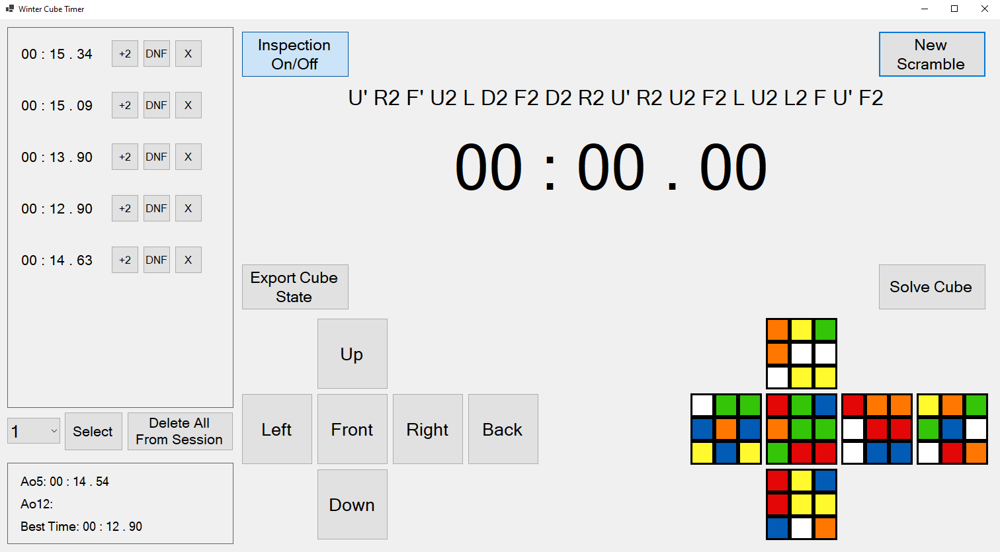

# WinterCubeTimer

## Time your solves with generated WCA style scrambles, switch between sessions, +2, DNF or remove times, enable/disable inspection, live preview of the current scramble, see averages and best time, export the current cube state and scramble, and solve the cube using Kociemba.

## Technologies: .NET 9.0, C# Winforms, SQLite, Kociemba (https://github.com/Megalomatt/Kociemba)

## Instructions (You need .NET 9.0 runtime to run this program): 
- Option 1: Download latest release
- Option 2: Cloning:
  - a) Open the .sln file in your preferred IDE, build and run the solution from there.
  - b) Build and run the solution using the dotnet cli:
  
    `dotnet build --configuration Debug` or `dotnet build --configuration Release`
  
    `dotnet run --configuration Debug` or `dotnet run --configuration Release`

